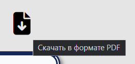

[![Contributors][contributors-shield]][contributors-url]
[![Commits][commits-shield]][commits-url]
[![Forks][forks-shield]][forks-url]
[![Pulse][pulse-shield]][pulse-url]
[![LinkeDIn][linkedin-shield]][linkedin-url]

<!-- PROJECT LOGO -->
 

  

  <h3 align="center">Automation of accounting orders for unmanned auto vehicles</h3>

  

    &#171;Автоматизация учёта заказов на беспилотном автомобильном транспорте&#187;
  

## About
Веб-приложение для дипломной бакалаврской выпускной работы.  
[made with: `PHP`, `VueJS`, `SQL`, `HTML` & `SCSS`].

## UI Preshow

    

        
        

            Главная страница веб-приложения
        

    

     
    

        
        

            Страница с авторизацией в веб-приложении
        

    

      
    

        
        

            Страница с регистрацией в веб-приложении
        

    

      
    

        
        

            Пример валидации полей для ввода данных
        

    

      
    

        
        

            Успешный вход в систему
        

    

      
    

        
        

            Личный кабинет пользователя
        

    

      
    

        
        

            Страница со списком товаров в веб-приложении
        

    

      
    

        
        

            Весь список товаров без пагинации
        

    

      
    

        
        

            Поиск товаров по таблице с данными
        

    

      
    

        
        

            Оформление заказа
        

    

      
    

        
        

            Список товаров и функция их удаления из корзины
        

    

      
    

        
        

            Пустой список товаров корзины
        

    

    

        
        

            Накладная по оформленному заказу
        

    

      
    

        
        

            Кнопка для скачивания накладной в PDF-формате
        

    

      
    

        
        

            Накладная по заказу в PDF-формате
        

    

      
    

        
        

            Страница «Список авто» для автомехаников
        

    

    

        
        

            Страница «Список заказов клиентов» для менеджеров
        

    

      
    

        
        

            Добавление нового заказа
        

    

      
    

        
        

            Изменение данных накладной
        

    

      
    

        
        

            Панель управления базой данных для администратора
        

    

      
    

        
        

            Пример страницы с панелью управления БД
        

    

<a href="#readme-top">⬆</a>

<!-- MARKDOWN LINKS & IMAGES -->
[contributors-shield]: https://img.shields.io/badge/%D0%A1ontributors-omg?style=for-the-badge&logo=git&labelColor=black&color=darkblue&link=https%3A%2F%2Fgithub.com%2FFaitsumaru%2Fproducts-ordering-site%2Fgraphs%2Fcontributors
[contributors-url]: https://github.com/Faitsumaru/products-ordering-site/graphs/contributors
[commits-shield]: https://img.shields.io/badge/Commits-omg?style=for-the-badge&labelColor=black&color=darkblue&link=https%3A%2F%2Fgithub.com%2FFaitsumaru%2Fproducts-ordering-site%2Fgraphs%2Fcommit-activity
[commits-url]: https://github.com/Faitsumaru/products-ordering-site/graphs/commit-activity
[forks-shield]: https://img.shields.io/badge/Forks-omg?style=for-the-badge&labelColor=black&color=darkblue&link=https%3A%2F%2Fgithub.com%2FFaitsumaru%2Fproducts-ordering-site%2Fforks
[forks-url]: https://github.com/Faitsumaru/products-ordering-site/forks
[pulse-shield]: https://img.shields.io/badge/Pulse-omg?style=for-the-badge&color=darkblue&link=https%3A%2F%2Fgithub.com%2FFaitsumaru%2Fproducts-ordering-site%2Fpulse
[pulse-url]: https://github.com/Faitsumaru/products-ordering-site/pulse
[linkedin-shield]: https://img.shields.io/badge/LinkeDIn-omg?style=for-the-badge&logo=linkedin&color=darkred&link=https%3A%2F%2Fwww.linkedin.com%2Fin%2Fgleb-kiryakov-629196299%2F
[linkedin-url]: https://www.linkedin.com/in/gleb-kiryakov-629196299/

[car-photo]: images/hero_car.png

